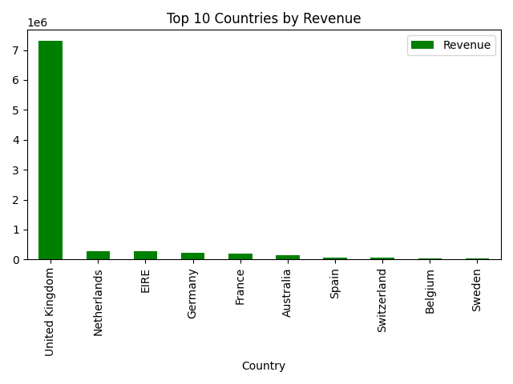
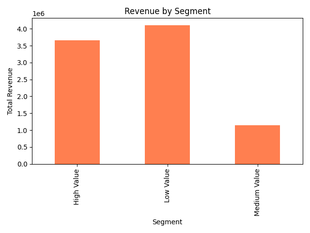
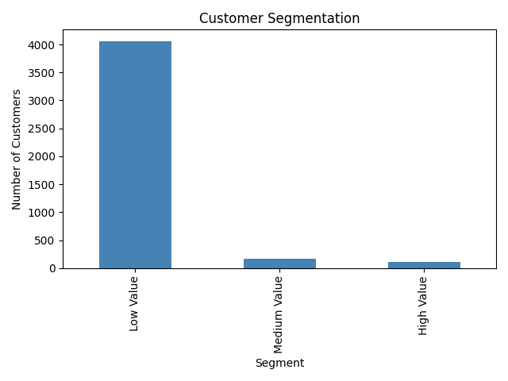

# Customer Segmentation using Machine Learning

##  Overview

This project performs customer segmentation using transaction data to identify different customer groups based on purchasing behavior.

---

##  Tools & Technologies

* Python
* Pandas
* NumPy
* Matplotlib
* Scikit-learn

---

##  Algorithm Used

* K-Means Clustering

---

##  Key Insights

* Majority customers belong to **Low Value segment**
* High-value customers are fewer but generate high revenue
* United Kingdom contributes the highest revenue
* Medium-value customers have growth potential

---

##  Visualizations

###  Top Countries by Revenue

###  Revenue by Segment

###  Customer Segmentation

---

##  Project Files

* segmentation.ipynb → Model & analysis
* Visualizations → Charts used in analysis

---

##  Conclusion

Customer segmentation helps businesses identify valuable customers, improve targeting, and increase profitability.

---

##  Dataset

Dataset is not uploaded due to size limitations.
You can use any retail dataset (e.g., Online Retail dataset from Kaggle).
